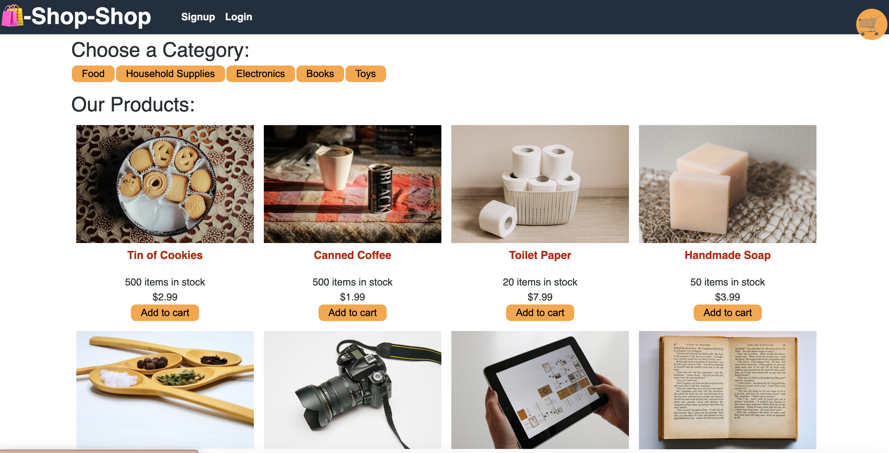

# Ecommerce-Redux

## Description
This is a online store built using MERN, GraphQL with Apollo server, MOngoDB, Nodejs/Express, REACT frontend. Redux is  used to store global state of the store. Stripe library is used to test payments.

## Tables of content:
  * [Installation](#installation)
  * [Usage](#usage)
  * [License](#license)
  * [Contributors](#contributors)
  * [Test](#test)
  * [Questions](#questions)

## Installation

1. Install node.js to run this application
2. Create a .gitignore file and include node_modules/ and .DS_Store/ so that your node_modules directory isn't tracked or uploaded to GitHub. Be sure to create your .gitignore file before installing any npm dependencies.
3. Make sure that your repo includes a package.json with the required dependencies. You can create one by running npm init when you first set up the project, before installing any dependencies.
4. Create the react app with aoo name client with [Create React App].[npx create-react-app <app-name>]
5. Run command npm i express to create Express.js for Routing.
6. Run command npm i mongoose to create mongoose package to connect MongoDB database.
7. Install bcrypt,jsonwebtoken,graphql,apollo-server-express and @apollo/client.
8. Set up an Apollo Server to use GraphQL queries and mutations to fetch and modify data.
9. Created an Apollo Provider so that requests can communicate with an Apollo Server.
10. Deployed application to Heroku with a MongoDB database using MongoDB Atlas.

## Usage 

## Contributors
shruthi

## Test
npm test

## Questions
  * GitHub Username : shruthisalimath
  * Email: shruthi@test.com
  * GitHub profile : https://github.com/shruthisalimath 

## Mock Up
The following animation shows how a user can register using the Signup page and then navigate to the Products page:

The following animation shows how the user can select a category, choose a product, view details about it on the product page, and add and remove it from their shopping cart:

Finally, the user can check out by going to their shopping cart, as shown in the following animation:

## ScreenShot

## URL
1. The URL of the Heroku Delpoyed application:
https://ecommerce-reduxstore-cee327809737.herokuapp.com/

2. The URL of the GitHub repository:
https://github.com/shruthisalimath/Ecommerce-Redux